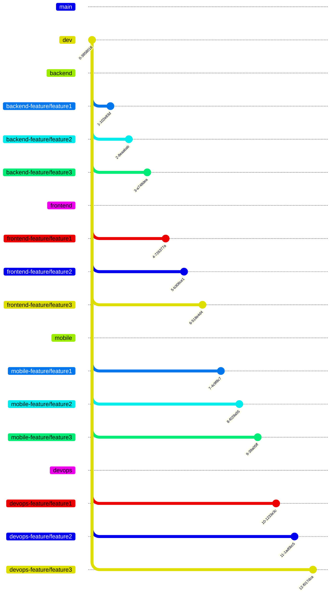

# Developer Documentation

[main documentation](../README.md)

# SUBJECT

This documentation aims to list the architecture of the project, github branches and commit standards. How the project is structured so you can implement other features while keeping the same implementation standard.

# Commit standards

*status header message   body message*

Possible status:
 - UPD update code like refactor, clean code
 - ADD add new file / feature
 - DEL delete file / feature

**example:**
 - **[UPD] code authentication” “modify file auth.go ...**

# Branch standards

**format: kebab case**
*Feature branch: [upper branch name]-feature/[feature-name]*

## Achitecture

