# User Guide

This guide aims to explain to the user how to make the most of the experience.

---

## Keyboard Navigation

All pages are navigable via the keyboard using the following keys:

- **(SHIFT +) TAB**: Navigate between elements
- **ENTER**: Confirm the current selection
- **SPACE**: Confirm an action or reaction to customize it
- **ESCAPE**: Close a popup (e.g., deleting an area, confirming a creation, etc.)

## Accessibility for Color Blind Users

For individuals with color blindness, the site has been designed with colors that are easy to distinguish without difficulty.

---

## Guide to Elements on the Perimeter Website

Below are explanations of the available elements on the Perimeter site. Each explanation includes:

1. **[PHOTO]**: A page of the website highlighted with colored frames
2. **[LEGEND]**: An explanation of colored frames in the image

---

## Login Screen

**This is used by users to login to the Perimeter website**
*Be sure to have correct credentials, else you will see an error message*
*Register / Sign up is almost the same as the Log In page*

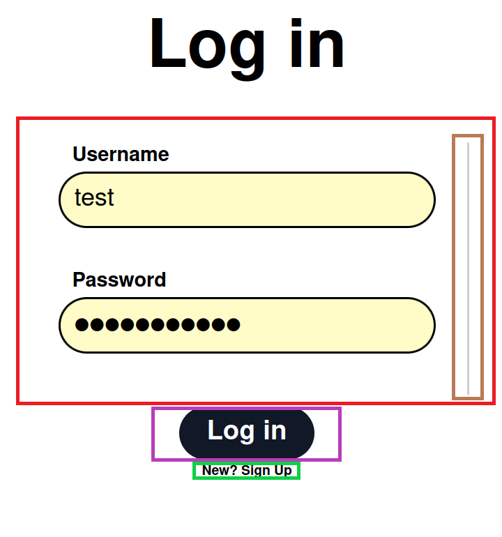

**Legend:**
- **Red Frame** - Fields to log in to your account - *Left click / Tab*
- **Purple Frame** - Log in button - *Left Click / Enter*
- **Green Frame** - Redirect to register / sign up page (if you want to create a new account without services connection) - *Left Click / Enter*
- **Brown Frame** - Scroll bar: use it to scroll down and access connections by service - *Mouse wheel / Tab*
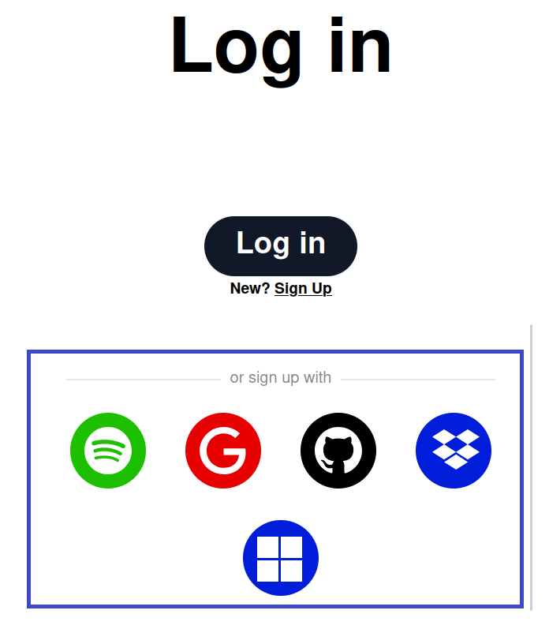
**Legend:**
- **Blue Frame** - Connect using OAuth2 from different services - *Left Click / Enter*

---

## Navigation Bar

**Used to navigate to the different pages of the website**

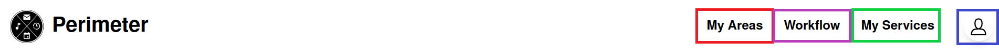
**Legend:**
- **Red Frame** - Link to areas you have created - *Left Click / Enter*
- **Purple Frame** - Link to the page for creating areas (actions & reactions) - *Left Click / Enter*
- **Green Frame** - Link to the page for connecting to services.
Without being connected, you will have access to fewer options for actions and reactions - *Left Click / Enter*
- **Blue Frame** - User Panel: Click to open a panel where you can view your username, access settings, or log out (see image bellow) - *Left Click / Enter*

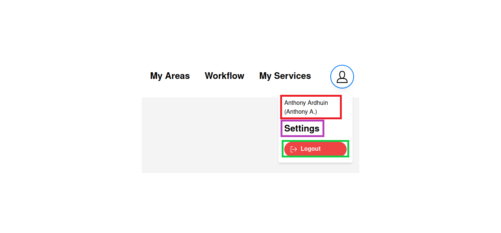
**Legend:**
** You can navigate in the panel using up & down arrows **
- **Red Frame** - Display your username
- **Purple Frame** - Link to the settings page where you can view your information and delete your account - *Left Click / Enter*
- **Green Frame** - Log out of your account - *Left Click / Enter*

---

## My Services

**Used to connect / disconnect to services. These services are used to create an action / reaction for your area.**
*(e.g., Receive a mail from gmail (Google) -> Skip the current music on Spotify)*
**Without connecting to services, you will only have access to basic ones like Timer / Weather**

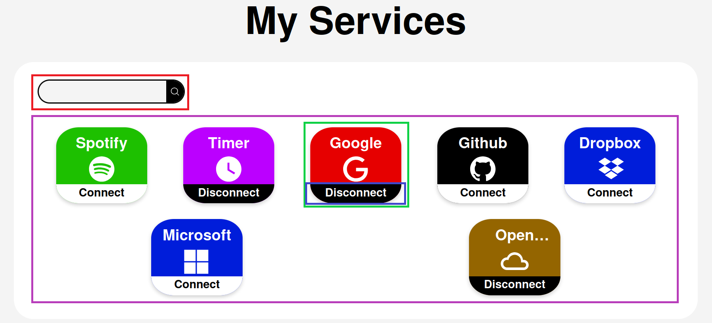
**Legend:**
- **Red Frame** - Search bar to filter services when searching for a specific name - *Left Click / Enter*
- **Purple Frame** - List of all services available to use for actions/reactions - *Left Click / Enter*
- **Green Frame** - Service you can connect to; interact with it to be redirected to the authentication page for this service - *Left Click / Enter*
- **Blue Frame** - Connection status: displays whether you are connected or not; services like Timer will always be connected - *Left Click / Enter*

---

## Workflow

**Used to create your area. Take an action, a reaction, add a title and your area is created !**

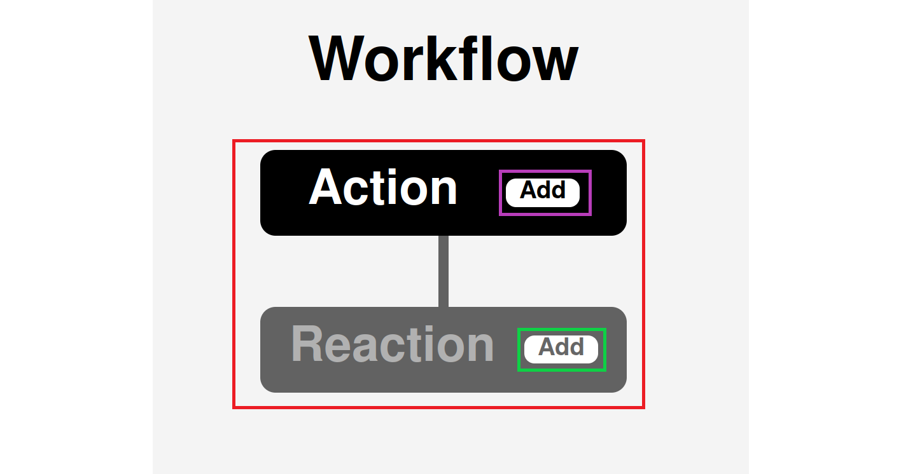
**Legend:**
- **Red Frame** - Displays your Actions/Reactions based on the current stage of creation
- **Purple Frame** - Add an action to your workflow - *Left Click / Enter*
- **Green Frame** - Non-clickable 'Add Reaction' button; you need to add an action first

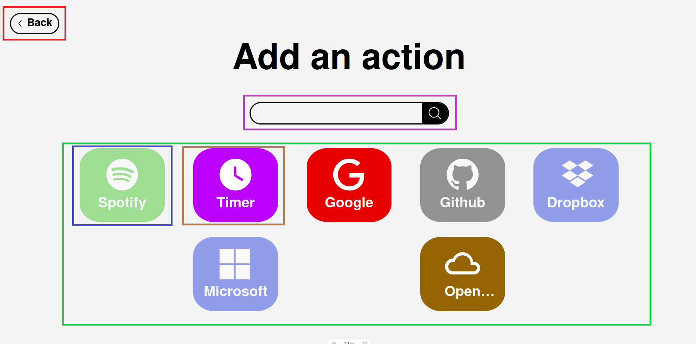
**Legend:**
- **Red Frame** - Go back button - *Left Click / Enter*
- **Purple Frame** - Search bar: use it to find a specific service - *Left Click / Enter*
- **Green Frame** - List of all services available on Perimeter for actions
- **Blue Frame** - When you are not connected to a service, it will appear less colorful, like this
- **Brown Frame** - Service you are connected to (more color); interact to see which actions are available - *Left click / Enter*

**Note: This action page will also apply to reactions. For any questions about selecting a reaction, please refer to this action guide**

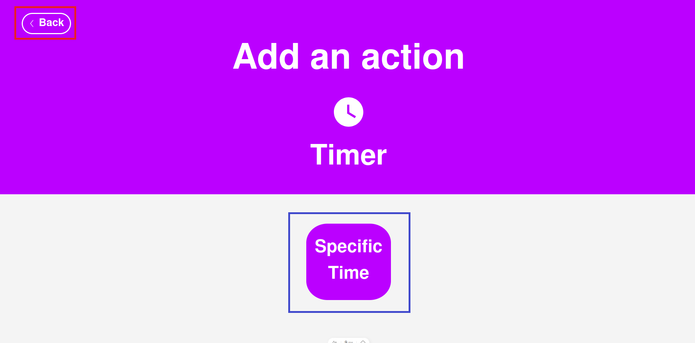
**Legend:**
- **Red Frame** - Go back button, if you don't want to use this service anymore - *Left Click / Enter*
- **Blue Frame** - List of actions available for this service; interact to view more details and configure them - *Left click / Space*

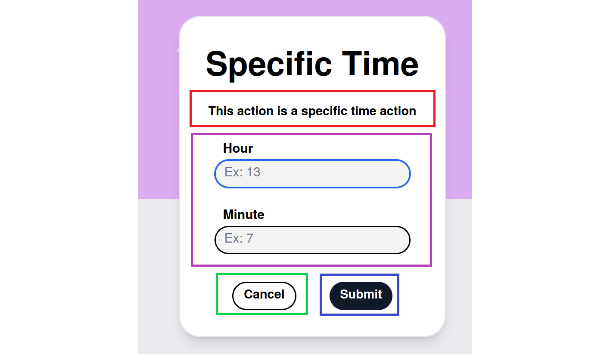
**Legend:**
- **Red Frame** - Short description
- **Purple Frame** - Fields to configure the selected action. **Some actions, such as 'Receive a mail,' do not require configuration.** - *Left Click / Enter*
- **Green Frame** - Cancel button - *Left Click / Enter*
- **Blue Frame** - Submit button - *Left Click / Enter*

**Legend:**
- **Red Frame** - Create Button, go to the last step - *Left Click / Enter*

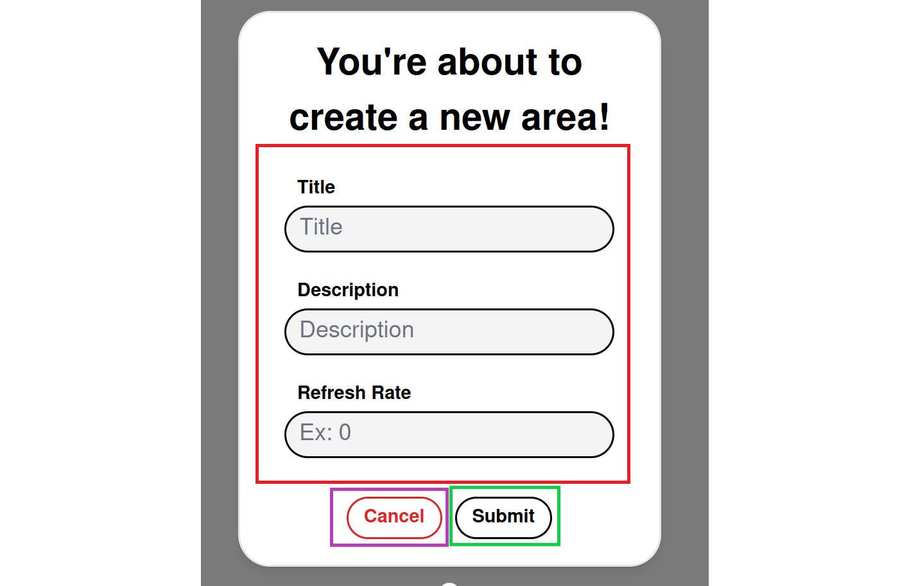
**Legend:**
- **Red Frame** - Fields to configure your new area. Refresh Rate refers to the interval at which the area is attempted to execute - *Left Click / Tab*
- **Purple Frame** - Cancel Button, go back - *Left Click / Enter*
- **Green Frame** - Submit button: confirm your choices and create your new area - *Left Click / Enter*

---

## My Areas

**This feature allows the user to view the areas he created. You can edit, disable, or delete areas as desired.**

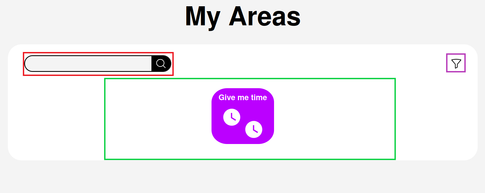
**Legend:**
- **Red Frame** - Search bar: use it to find a specific area - *Left Click / Tab*
- **Purple Frame** - Filter your areas by creation date, either oldest first or newest first - *Left Click / Enter*
- **Green Frame** - List of all the areas you have created. Interact with it to view details - *Left Click / Enter*

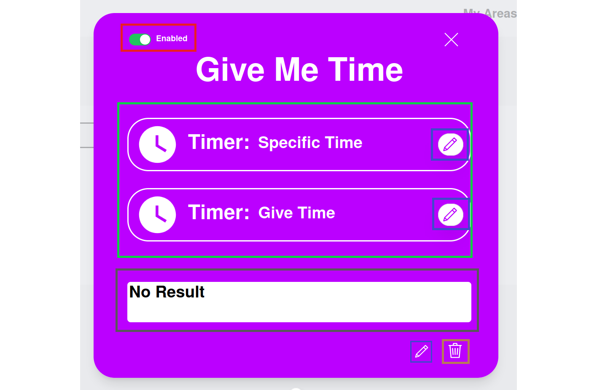
**Legend:**
- **Red Frame** - Enable or disable the current area by interacting with it - *Left Click / Tab*
- **Green Frame** - Information on the actions/reactions present in your area
- **Blue Frame** - Edit button: Opens the edit panel; see the screen below - *Left Click / Enter*
- **Brown Frame** - Delete button: opens a confirmation for this deletion - *Left Click / Enter*
- **Grey Frame** - Display result of your area

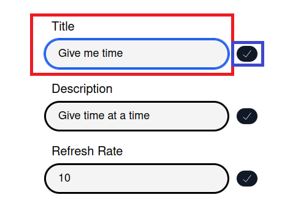
**Legend:**
- **Red Frame** - Fields you can edit  - *Left Click / Tab*
- **Blue Frame** - Submit button - *Left Click / Enter*

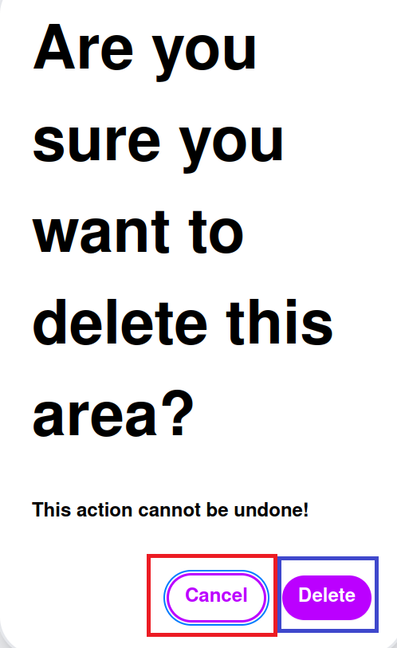
**Legend:**
- **Red Frame** - Cancel button  - *Left Click / Enter*
- **Blue Frame** - Delete button **Action cannot be undone!** - *Left Click / Enter*
