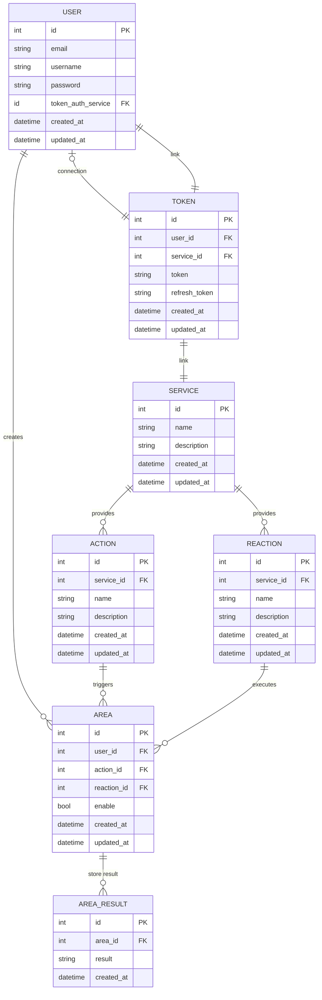

# Database Documentation

## Table of Contents

- [Database Documentation](#database-documentation)
  - [Table of Contents](#table-of-contents)
  - [Main Document](#main-document)
  - [View](#view)

## Main Document

[main documentation](../../README.md)

## View

