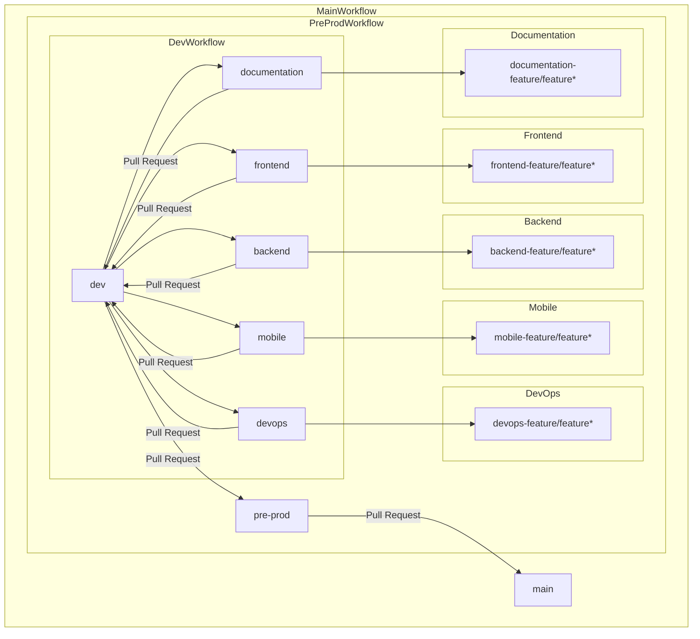
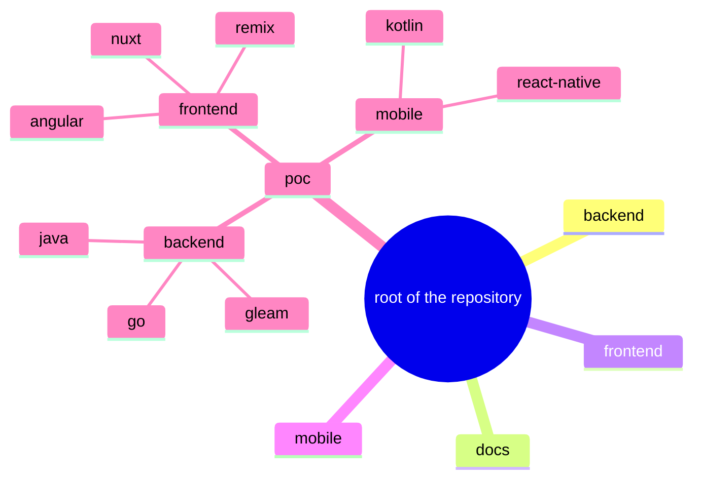

# Developer Documentation

## Table of Contents

- [Developer Documentation](#developer-documentation)
  - [Table of Contents](#table-of-contents)
  - [Main Document](#main-document)
  - [Subject](#subject)
  - [Git](#git)
    - [Commit](#commit)
    - [Branch](#branch)
    - [Pull Request](#pull-request)
  - [Architecture](#architecture)
    - [File](#file)
    - [Folder - Directory](#folder---directory)
    - [Visual](#visual)

## Main Document

[main documentation](../README.md)
## Subject

This documentation aims to list the architecture of the project, github branches and commit standards. How the project is structured so you can implement other features while keeping the same implementation standard.

## Git

### Commit

- [status] header message body message
- Possible status:
  - UPD update code like refactor, clean code
  - ADD add new file / feature
  - DEL delete file / feature
  - WIP work in progress
- Example:
- “[UPD] code authentication” “modify file auth.go …”

### Branch

- All branch: kebab case
- Feature branch: [upper branch name]-feature/[feature-name]

### Pull Request

You have to assign someone

## Architecture

### File

camel case

### Folder - Directory

kebab case

### Visual

