# User Mobile Documentation

## Table of Contents

- [User Mobile Documentation](#user-mobile-documentation)
  - [Table of Contents](#table-of-contents)
  - [Main Document](#main-document)
  - [What is it ?](#what-is-it-)
  - [How to use it ?](#how-to-use-it-)
    - [First step](#first-step)
    - [Signup screen](#signup-screen)
    - [Login screen](#login-screen)
    - [Area Views](#area-views)
    - [Create an Area](#create-an-area)

---

## Main Document

[main documentation](../README.md)

---

## What is it ?

This app is a tool to automate tasks in your digital life. Think of it as a personal assistant that connects your favorite services—like Gmail, Microsoft, or Dropbox—and makes them work together. For example, you can set it up to automatically save email attachments to your cloud storage or post updates to multiple social media platforms at once. The app simplifies repetitive tasks, letting you focus on what really matters.

## How to use it ?

### First step

Add the ip address of your server to cummunicate between the app and the server.

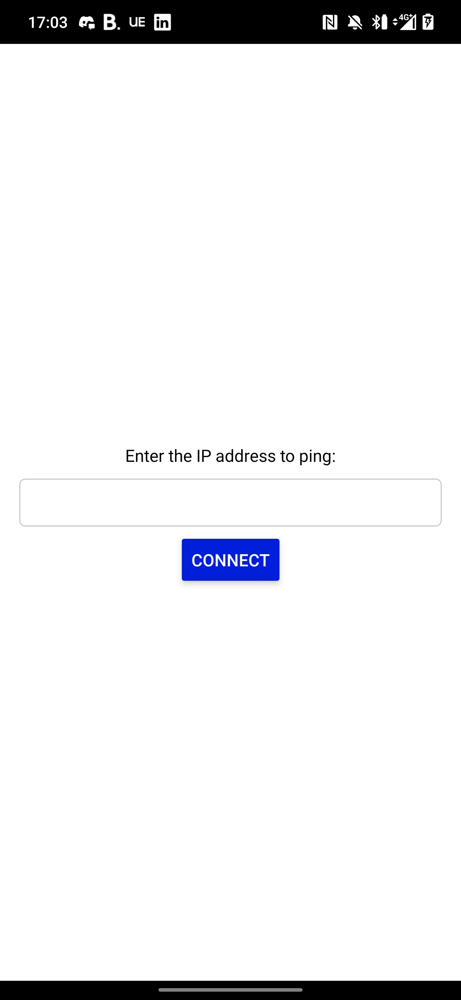

### Signup screen

You can signup with an email, user and password or use Oauth2 with the services available. This email/usename need to be unique!

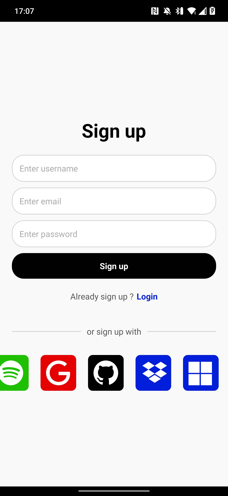
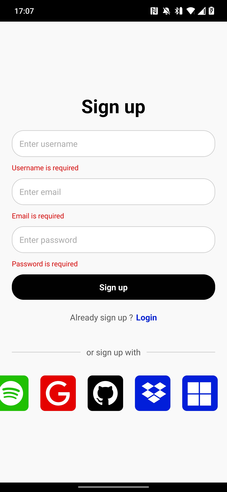

### Login screen

Same as the signup, you can login with your username and password or use the Oauth2 if your Oauth2 account has not the same email than your account already signup.

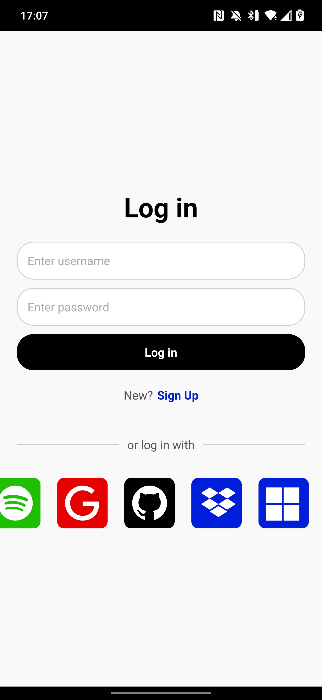
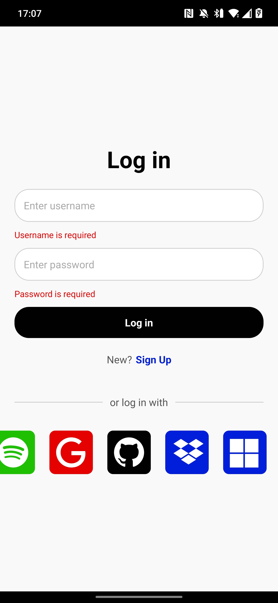

### Area Views

After login/signup, you will be redirect to the area view to check and modif all your areas.

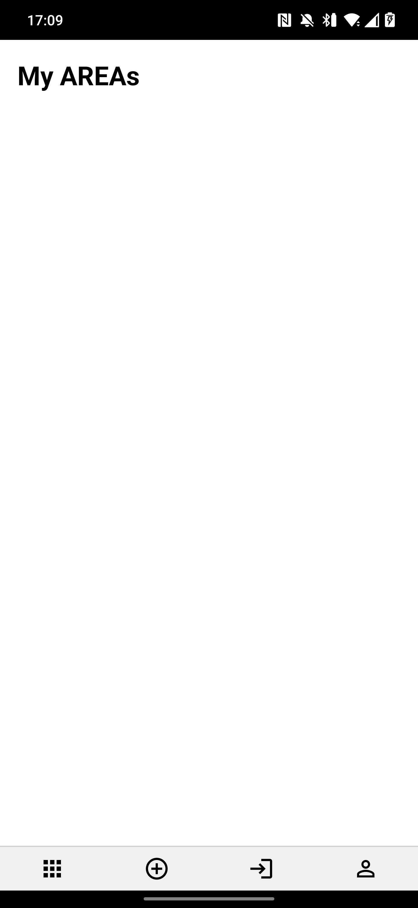

### Create an Area

The second tab allows you to create your areas.

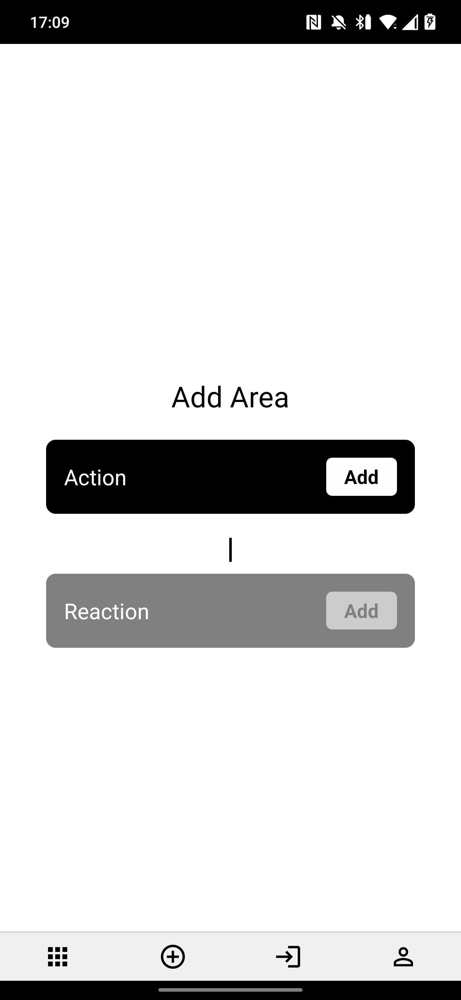

You can select the service to see all action the service has, gray services are the service that you aren't connected.

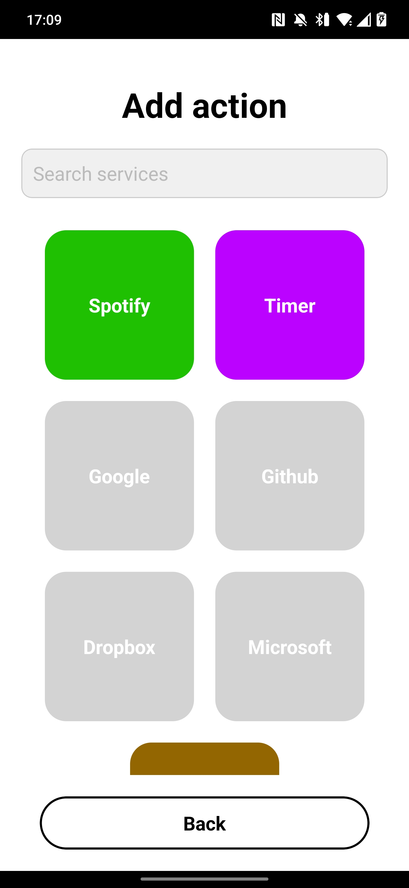
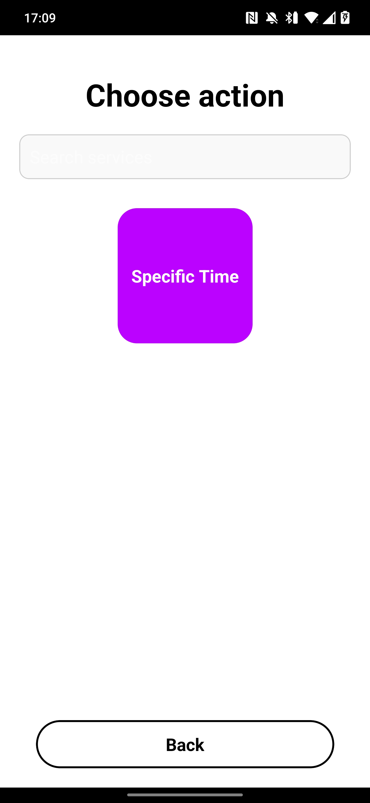

After selecting you action, you need to fill the options if the action had one and save to select after your reaction

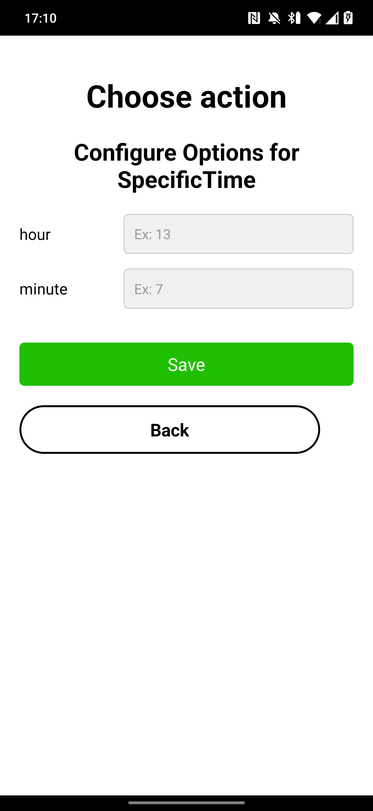

Now you can select your reaction.

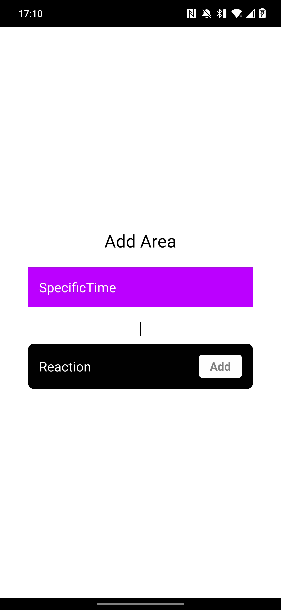
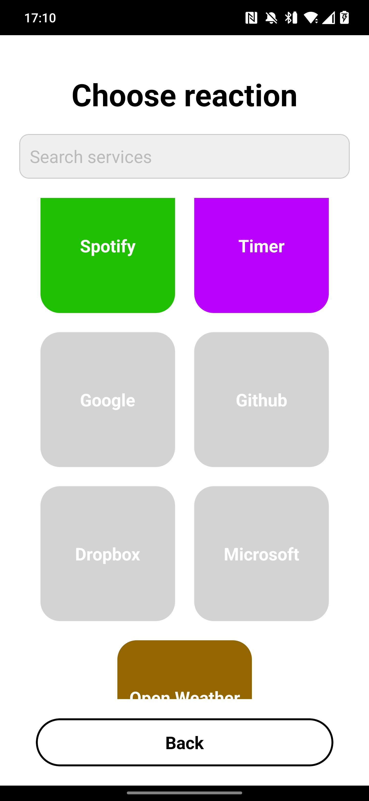
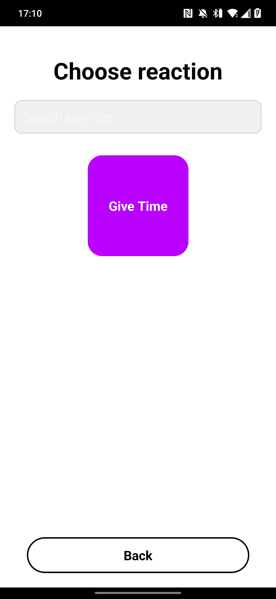
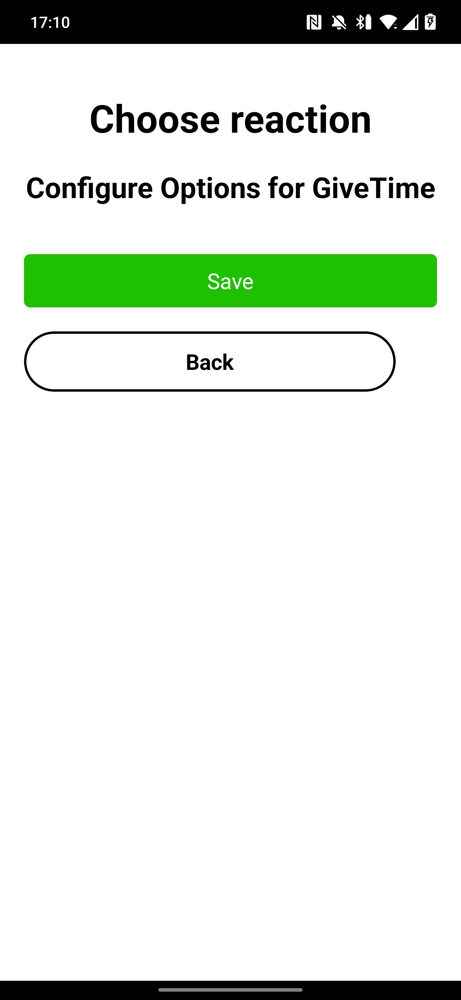

After saving your reaction, you can add a title and description and add a refresh timer to choose at what frequencies the area refresh (min 10 seconds).

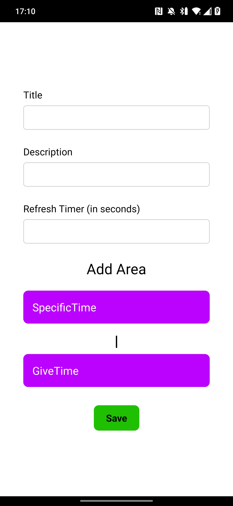

Now you can switch to the area view (tab 1) and check the area details created.

Click in the area to check the details of the area, enable/disable the area, modify it or delete. You can see also the area results of the reaction.

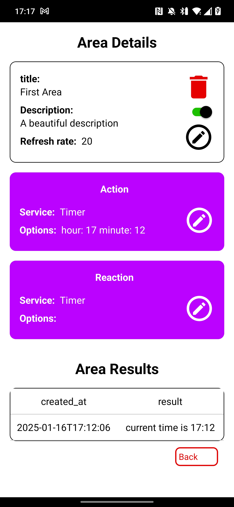
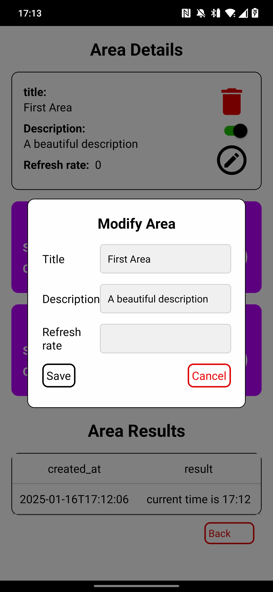
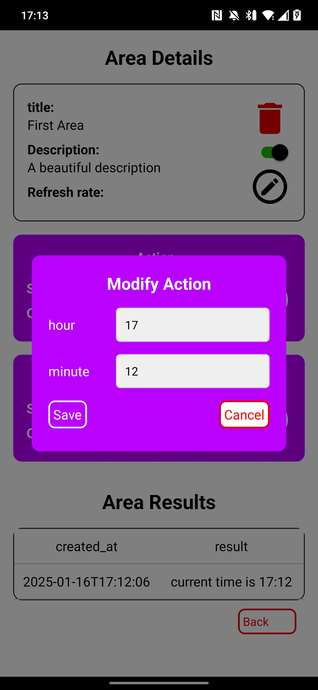
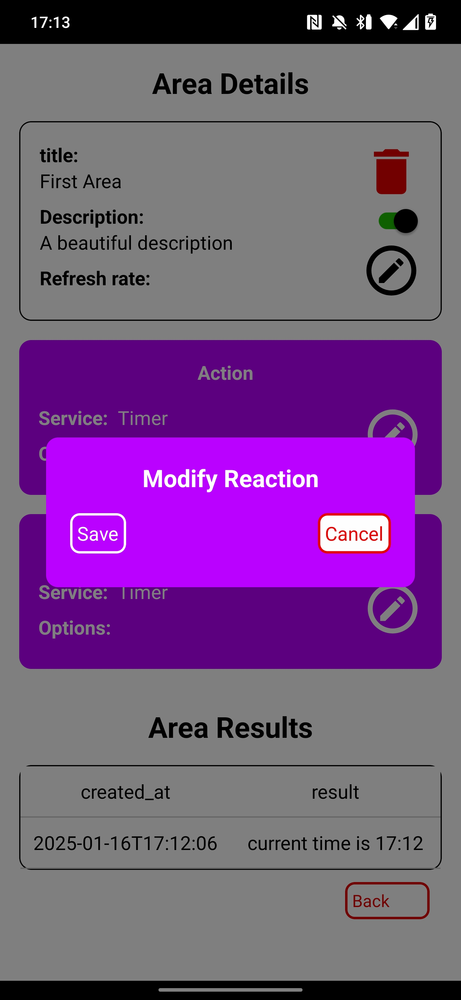

The last 2 tabs are the services tab to connect/deconnect to all services and the settings tab

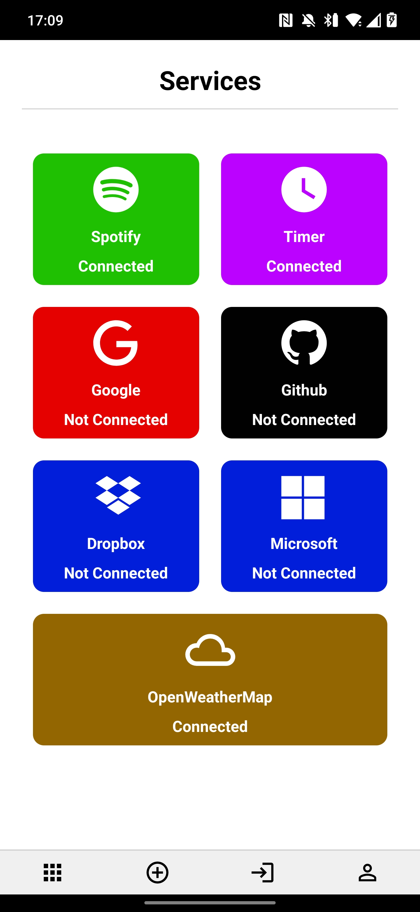
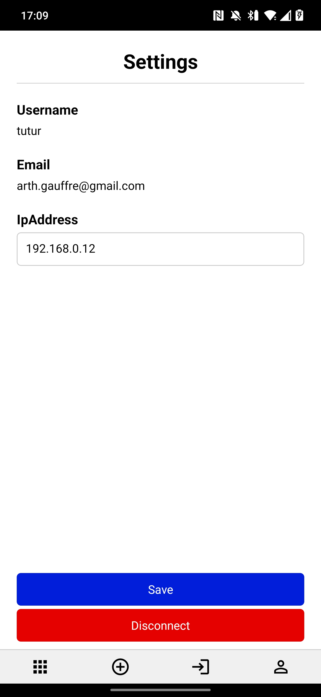
